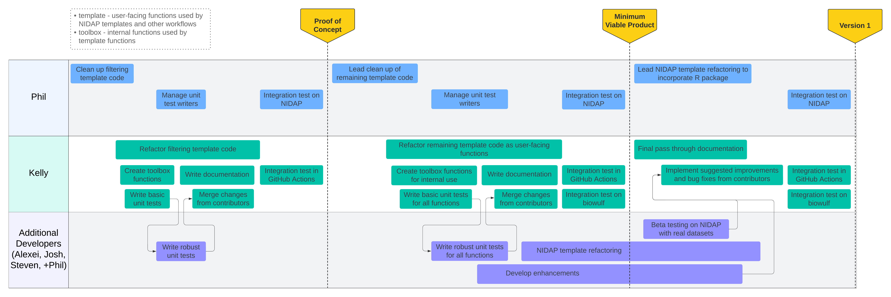

<!-- README.md is generated from README.Rmd. Please edit that file -->

```{r, include = FALSE}
knitr::opts_chunk$set(
  collapse = TRUE,
  comment = "#>",
  fig.path = "man/figures/README-",
  out.width = "100%"
)
```

# reneeTools

<!-- badges: start -->

[](https://github.com/CCBR/reneeTools/actions/workflows/R-CMD-check.yaml)

<!-- badges: end -->

Helper functions for [RENEE](https://github.com/CCBR/renee): RNA sequencing analysis pipeline

## Installation

You can install the development version of reneeTools from [GitHub](https://github.com/) with:

```r
# install.packages("devtools")
devtools::install_github("CCBR/reneeTools")
```

<!--
## Example

TODO: This is a basic example which shows you how to solve a common problem:

```{r example}
library(reneeTools)
## basic example code
```
-->

## Help & Contributing

Come across a **bug**? Open an [issue](https://github.com/CCBR/reneeTools/issues) and include a minimal reproducible example.

Have a **question**? Ask it in [discussions](https://github.com/CCBR/reneeTools/discussions).

Want to **contribute** to this project? Check out the [contributing guidelines](.github/CONTRIBUTING.md).

## Development Roadmap



- [dev spreadsheet](https://nih-my.sharepoint.com/:x:/g/personal/homanpj_nih_gov/ETvHXgnwxExEpcP57Jj9_EwBHBvZBqNuZ_c3eu51w-SlnA?e=PcXKU8)
- [project board](https://github.com/orgs/CCBR/projects/32)
